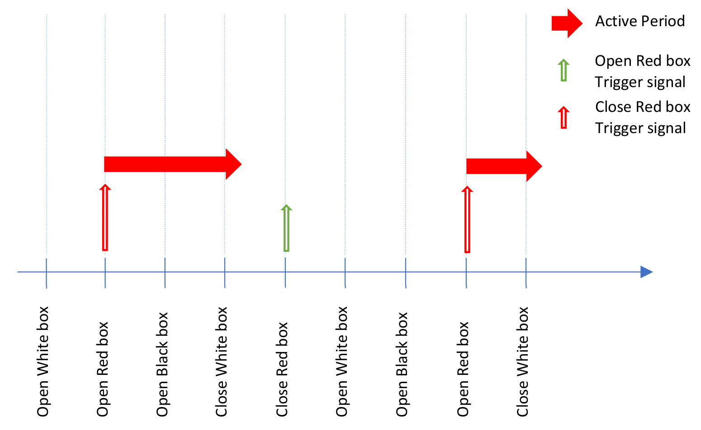
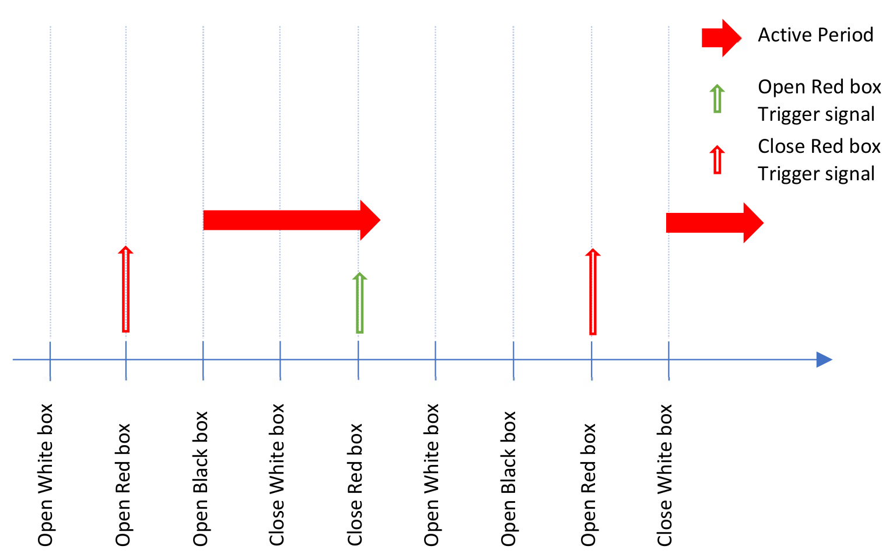
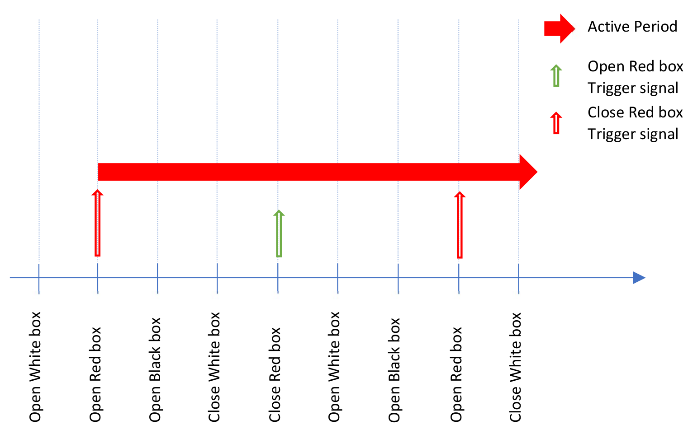
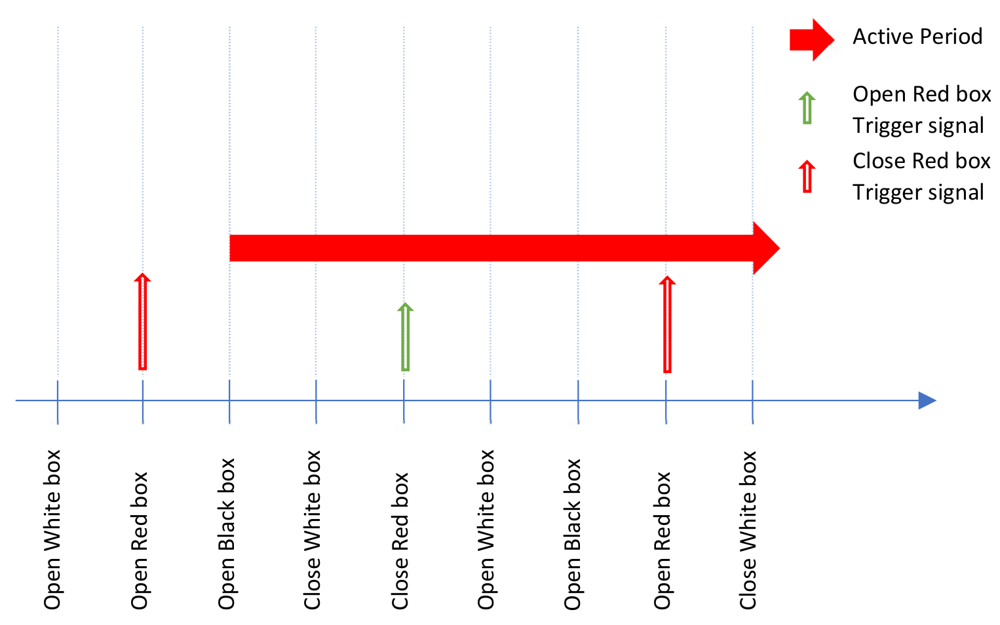

CHAPTER 4: Verb Tenses and Propositions in TextWorld
====================================================

Proposition is one state element object. Each proposition defines the status of one entity of the game; e.g. an open
box, which is named as 'c_0', has a proposition in state set as follows:

::

    is__open(c_0:c)

Also, it includes a verb tense which can represent that *when* or *since when* that proposition is valid. TextWorld
supports 4 verb tenses:

* "Present", which is defined by "is", is the default verb tense for any proposition and descries the current valid status of the entity. "is__open" means that the entity's status is open now. When the openable entity is opened by the player, this proposition automatically is added to the list of propositions of the state. When the player closes it, this proposition is removed from the state immediately.

* In contrast to present, "Past" tense reflects that the corresponding proposition was valid before; i.e. the corresponding command/action was applied before and this action can be traced by this past tense proposition within the game. The simple past proposition remains till the reverse action is taken by the player. For instance, when the player chooses to open the box, the *is__open* proposition is added to the state. Moreover, if the game is designed to track the happening of this action with the simple past tense, then the *was__open* proposition will be added to the state at the next step of the game; it means that "the box was open". This past proposition is not stay in the game state forever. When the player uses the "close the box" action, the *is__open* proposition is replaced by the *is__closed* proposition in the game state. The *was__open* proposition will be removed in the next step of the game and its effect will be finished.

* "Past Present" is represented by "has_been". It means that an specific action has happened before and its effect remains during the game forever, even the reverse action also happens. Similar example as previous, when the box is open, both *is__open* and *has_been__open* propositions are simultaneously added to the state set. When the box is closed the *is__open* proposition is removed; however, the *has_been__open* proposition stays to the end of the game.

* "Perfect Past" is another verb tense that TextWorld supports. Likewise, it traces an actions which happened before and its effect remains all over the game. The difference between *has_been* proposition with *had_been* proposition is the time it is added to the state. The *had_been* proposition appears in the game state at the next step respect to when the action happens.

The following table represents how these verb tenses perform and appear in the game state. In the following example,
it is assumed that the action of opening the red box (i.e. it is called c_0 in the framework) is been tracking during
the game.

+---------------------+-----------------+----------------+---------------------+---------------------+
| Sequence of Actions |  Simple Present |  Simple Past   |   Present Perfect   |    Past Perfect     |
+=====================+=================+================+=====================+=====================+
| Open Red box        |  is__open(c_0)  |                | has_been__open(c_0) |                     |
+---------------------+-----------------+----------------+---------------------+---------------------+
| Next action         |  is__open(c_0)  | was__open(c_0) | has_been__open(c_0) | had_been__open(c_0) |
+---------------------+-----------------+----------------+---------------------+---------------------+
| Next action         |  is__open(c_0)  | was__open(c_0) | has_been__open(c_0) | had_been__open(c_0) |
+---------------------+-----------------+----------------+---------------------+---------------------+
| Close Red box       | is__closed(c_0) | was__open(c_0) | has_been__open(c_0) | had_been__open(c_0) |
+---------------------+-----------------+----------------+---------------------+---------------------+
| Next action         |                 |                | has_been__open(c_0) | had_been__open(c_0) |
+---------------------+-----------------+----------------+---------------------+---------------------+

The following figures also represent this feature based on the timing that the traceable command is triggered, and the
duration of its stay in the state based on various verb tenses,

+-----------------------------------------------+
|                |PresentTense|                 |
+===============================================+
|     Performance of the Present verb tense     |
+-----------------------------------------------+

+--------------------------------------------+
|                |PastTense|                 |
+============================================+
|     Performance of the Past verb tense     |
+--------------------------------------------+

+-----------------------------------------------+
|            |PresentPerfectTense|              |
+===============================================+
| Performance of the Present Perfect verb tense |
+-----------------------------------------------+

+--------------------------------------------+
|             |PastPerfectTense|             |
+============================================+
| Performance of the Past Perfect verb tense |
+--------------------------------------------+